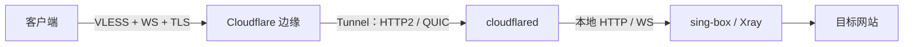

# ARGO · 隧道与节点管理

在 Alpine / Debian / Ubuntu VPS 上管理 Cloudflare Tunnel，并部署 **sing-box 或 Xray 的 VLESS + WebSocket + TLS 节点**。

支持临时隧道、固定隧道、Cloudflare API 自动部署、后台节点信息同步，以及 BBR 管理。服务交给 OpenRC / systemd 管理，支持进程退出重启和开机自启。

> 仓库：**Alsyok/argo** · 入口：**CFtunnel.sh**
>
> 本说明对应包含主菜单 1–16 的脚本。核心版本由下载清单决定，不固定写死。

## 快速开始

使用 root 登录 VPS。系统需要有可用的网络、包管理器和运行中的服务管理器。

### 一键运行

已安装 Bash 和 curl 时：

```bash
bash <(curl -Ls https://raw.githubusercontent.com/Alsyok/argo/main/CFtunnel.sh)
```

仓库刚更新但仍下载到旧文件时，退出旧脚本，再运行：

```bash
bash <(curl -Ls "https://raw.githubusercontent.com/Alsyok/argo/main/CFtunnel.sh?t=$(date +%s)")
```

### 下载后运行

脚本本身兼容 `/bin/sh`，Alpine 不必为了运行它额外安装 Bash：

```sh
curl -fL https://raw.githubusercontent.com/Alsyok/argo/main/CFtunnel.sh -o CFtunnel.sh
sh CFtunnel.sh
```

缺少 curl 时，先安装：

```sh
# Alpine
apk add --no-cache curl ca-certificates
```

```sh
# Debian / Ubuntu
apt-get update
apt-get install -y curl ca-certificates
```

## 系统支持

| 项目 | 支持范围 |
|---|---|
| 系统 | Alpine、Debian、Ubuntu |
| 服务管理 | Alpine / OpenRC；Debian、Ubuntu / systemd |
| CPU 架构 | Linux AMD64、ARM64 |
| 节点核心 | sing-box、Xray，安装时选择 |
| 本地入站 | VLESS + WebSocket，监听 `127.0.0.1` |
| 客户端连接 | VLESS + WebSocket + TLS，端口 443 |
| 运行权限 | root |

Debian / Ubuntu 的无 systemd 容器，以及 Alpine 的无 OpenRC 环境，不在脚本支持范围内。BBR 还取决于宿主内核和容器权限。

## 连接方式



客户端 TLS 由 Cloudflare 边缘提供。本机节点只监听回环地址，脚本不为本地入站配置 TLS，也不下载 Cloudflare 的证书私钥。

这里的 HTTP2 / QUIC 是 **cloudflared 与 Cloudflare 之间的隧道传输**，不是客户端节点协议的选择。

## 主菜单

| 编号 | 功能 |
|---|---|
| 1 | 安装临时隧道（保活 + 开机自启） |
| 2 | 安装固定隧道（保活 + 开机自启） |
| 3 | 查看隧道状态 / 域名 |
| 4 | 重启隧道 |
| 5 | 停止隧道 |
| 6 | 查看隧道日志 |
| 7 | 卸载隧道 / 选择删除 CF 隧道 |
| 8 | 安装 / 切换节点核心 |
| 9 | 查询节点信息 / 分享链接 |
| 10 | 重启节点 |
| 11 | 停止节点 |
| 12 | 查看节点日志 |
| 13 | 更新节点核心 |
| 14 | 卸载本脚本管理的节点核心 |
| 15 | 隧道传输：自动 / HTTP2 / QUIC |
| 16 | BBR 管理 |
| 0 | 退出 |

输入错误会重新提示。所有确认操作输入 `YES` / `y` 继续，`NO` / `n` 取消，不区分大小写，输入时不要带引号。方括号内通常为默认值或选择范围；填写参数时留空可使用提示中的默认值。

脚本使用普通终端屏幕，方便手机 SSH 滚动查看和复制。RGB 配色需要终端支持真彩色；设置 `NO_COLOR=1` 可关闭脚本颜色输出。

## 临时隧道

选择 **1**，输入本地 WS 端口、WS 路径和隧道传输。

连接成功后会显示 `*.trycloudflare.com` 域名，并询问是否安装 sing-box / Xray。已有隧道时需要确认替换配置。

- 无需提供 Tunnel Token 或自有域名。
- 后台运行、进程退出自动重启、开机自启。
- 临时域名重启后可能变化；保活不会让临时域名变成固定域名。
- 域名变化后，后台同步会在条件满足时更新本机节点信息；客户端已经导入的链接不会自动改变，需要重新查询、复制和导入。

## 固定隧道

选择 **2**，再选择手动模式或 API 接入模式。

### 手动模式

先在 Cloudflare 配置对应的公开主机名和服务地址，例如：

```text
域名：node.example.com
服务：http://127.0.0.1:10807
```

再按提示填写：

1. 完整域名，不含 `https://` 和路径。
2. 本地 WS 端口，与 CF 服务地址中的端口一致。
3. WS 路径，例如 `/argo`。
4. Tunnel Token，只粘贴令牌，不粘贴整条安装命令。
5. 隧道传输。

节点核心必须实际监听这个本地端口，仅启动 cloudflared 并不会自动产生 VLESS 入站。

### API 接入模式

首次进入需要先接入 API；已有凭据会先进行读取验证。

| 所需资料 | 用途 |
|---|---|
| API Token | 授权脚本读取和修改 Cloudflare 资源 |
| Account ID | 选择 CF 账户 |
| 域名区域（Zone） | 选择部署子域名所属的主域名 |

自定义 API Token 权限：

| 范围 | 权限 |
|---|---|
| 账户 | Cloudflare Tunnel：编辑 |
| 区域 | DNS：编辑 |
| 区域 | Zone：读取 |

Token 的资源范围需要覆盖相应账户和域名区域。读取验证通过不代表写入权限一定正确，实际部署时仍会检查 API 请求结果。

**API Token 与 Tunnel Token 不同**：前者用于管理 CF 资源，后者用于 cloudflared 连接某个隧道。凭据仅保存在 VPS 本机，不需要上传仓库。

接入后进入子菜单：

| 编号 | 功能 |
|---|---|
| 1 | 自动部署 |
| 2 | 修改配置 |
| 3 | 更换 API 凭据 / 域名区域 |
| 0 | 返回上一级 |

**自动部署**：选择已有的 CF 后台管理隧道或新建隧道，填写子域名、端口、WS 路径、UUID、核心与传输方式。脚本配置 CF 路由和 DNS，部署本机节点，并启动隧道与后台同步。

**修改配置**：修改当前 API 部署的参数。隧道名称留空保留原名；仅修改显示名称时，不重建隧道、不更换 Tunnel ID、不修改 Token、路由和本地节点，也不重启服务。

**更换 API 凭据 / 域名区域**：更新接入资料，不会立即重新部署已有节点。已有部署仍绑定其原来的域名区域；切换到其它账户后，不能直接修改属于旧账户的部署。

部署失败时会尝试恢复本机配置和已修改的远程资源；发现 CF 配置被其它操作改动时，不会强行覆盖它。修改子域名后，旧域名 DNS 可能保留，脚本会给出提醒。

## 节点配置与信息查询

安装隧道后可继续选择核心，也可通过 **8** 安装 / 切换核心。已有节点时可选择保留参数或修改 UUID、WS 路径、端口；修改参数时留空保留原值。

选择 **9** 查询当前节点信息及 `vless://` 分享链接。

本机保存位置：

```text
/etc/vps-node/node-info.txt
/etc/vps-node/node-link.txt
```

直接查看：

```sh
cat /etc/vps-node/node-info.txt
cat /etc/vps-node/node-link.txt
```

这些文件保存的是纯文本，终端显示颜色不会写入链接文件。

### 后台同步

后台服务 `vps-cf-sync` 每约 60 秒检查一次，查询节点信息时也会尝试同步。

- 临时隧道：检查当前域名以及节点参数。
- API 固定隧道：检查绑定路由、域名和本地节点参数，并在匹配、验证通过后更新节点信息。
- 无法读取 API、配置不匹配或节点配置尚未确认加载时，保留上次有效的信息并提示，不生成未经验证的新链接。
- 手动固定隧道未绑定 API 时，不能自动读取 CF 后台变更。

后台同步不是完整的双向配置管理，也不会自动把 CF 中的任意端口修改写进核心配置。建议使用脚本的“修改配置”；手动修改本地核心配置后，使用 **10** 重启并检查结果。

## 隧道传输与 BBR

### 隧道传输：菜单 15

| 选项 | 适用情况 |
|---|---|
| 自动 | 自动尝试连接，并按脚本逻辑切换传输 |
| HTTP2 | 出站 UDP 被禁或 QUIC 持续超时 |
| QUIC | 网络允许所需 UDP 出站连接 |

HTTP2 仍需要可用的 TCP 出站网络；切换传输不能解决所有网络限制。

### BBR：菜单 16

```text
1. 开启 BBR（保存开机参数）
2. 查看状态
0. 返回首页
```

开启时检查 BBR 是否可用，必要时尝试加载 `tcp_bbr`，设置并验证 TCP 拥塞控制；环境提供默认队列参数时同时设置 `fq`。失败时尝试恢复原设置，不自动安装或更换内核。

选 **2** 会明确显示当前使用的算法、默认队列和本脚本保存的开机参数，按回车返回。

- 显示 `BBR（已开启）`：当前 TCP 默认拥塞控制为 BBR。
- 显示 `cubic（未使用 BBR）`：当前使用其它算法。
- 显示 `默认队列规则：此环境无法读取`：该参数不可读取，不等于 BBR 没开启。
- “开机参数已保存”表示本脚本配置文件中保存了 BBR，不代替重启后的实际验证。

BBR 作用于 TCP，通常影响新建 TCP 连接；QUIC 使用 UDP，不受 TCP BBR 控制。脚本不会强制替换现有网卡队列，也不能保证开启 BBR 后一定更快。

## 卸载与删除

### 菜单 7：隧道

已接入 API 时显示 CF 隧道列表：

| 输入 | 行为 |
|---|---|
| `1` | 删除列表中的第 1 个 CF 隧道 |
| `1 2` | 删除第 1、2 个，编号用空格分隔后回车 |
| `A` | 删除列表中所有 CF 隧道 |
| `L` | 保留 CF 后台配置，仅卸载本机隧道 |
| `0` | 返回，不删除 |

远程删除前列出选中的隧道和 API 有权限读取的关联 DNS，确认后才执行。隧道删除成功后，再检查并清理仍指向它的 DNS；删除失败时保留 DNS。权限范围外的 DNS 需要自行检查。

删除当前 VPS 使用的 CF 隧道，会停止本机隧道并关闭后台同步；其它 VPS 若共用同一个隧道也会受影响。仍有连接器运行的隧道，CF 可能拒绝删除，需要先停止连接器再重试。

`L` 删除本机 cloudflared 程序、服务、配置、日志和本项目同步服务 / 凭据，**保留 CF 中的隧道、路由和 DNS，保留节点核心**。没有 API 接入时仍可执行本机卸载。

### 菜单 14：节点核心

卸载本脚本管理的节点核心、配置和保存的节点信息，并停止其后台同步。不负责卸载其它脚本安装的 sing-box / Xray。

BBR 参数独立于隧道 / 节点，卸载它们不会删除 BBR 设置。

## 服务与日志

| 服务 | 用途 |
|---|---|
| `vps-tunnel` | cloudflared 隧道 |
| `vps-node` | sing-box / Xray 节点 |
| `vps-cf-sync` | 节点信息后台同步 |

Alpine / OpenRC：

```sh
rc-service vps-tunnel status
rc-service vps-node status
rc-service vps-cf-sync status
rc-update show default
```

Debian / Ubuntu / systemd：

```sh
systemctl status vps-tunnel --no-pager
systemctl status vps-node --no-pager
systemctl status vps-cf-sync --no-pager
```

日志查询：

```sh
# 最近 50 行隧道日志
tail -n 50 /var/log/vps-tunnel/cloudflared.log

# 实时查看隧道日志，Ctrl+C 结束查看
tail -f /var/log/vps-tunnel/cloudflared.log

# 节点日志
tail -n 50 /var/log/vps-node.log

# 同步日志
tail -n 50 /var/log/vps-cf-sync.log
```

## 文件位置

| 路径 | 内容 |
|---|---|
| `/etc/vps-tunnel/` | 隧道配置、Token、运行脚本 |
| `/usr/local/lib/vps-tunnel/cloudflared` | 隧道程序 |
| `/etc/vps-node/` | 核心配置、UUID、路径、端口、节点信息 |
| `/usr/local/lib/vps-node/core` | 节点核心程序 |
| `/etc/vps-cf-api/` | API 接入凭据、部署绑定和同步状态 |
| `/usr/local/lib/vps-cf-sync/run` | 后台同步程序 |
| `/etc/sysctl.d/99-zz-argo-bbr.conf` | BBR 开机参数 |
| `/etc/modules` | Alpine 模块列表，开启 BBR 时保留原内容并补充模块 |
| `/etc/modules-load.d/argo-bbr.conf` | Debian / Ubuntu 的 BBR 模块配置 |

## 常见问题

**服务显示运行中，节点就一定能用吗？**

不一定。需要同时确认隧道连接、核心监听、本地端口和 WS 路径匹配。脚本可检查链路状态，完整的 VLESS 代理流量仍需在客户端测试。

**日志出现 QUIC 超时怎么办？**

如果 VPS 禁止出站 UDP，使用菜单 **15 → HTTP2**，再检查隧道连接。

**仅 IPv6 的 VPS 可以下载全部程序吗？**

sing-box / Xray 的清单和归档从仓库 `cores` 分支的 Raw 地址下载，支持通过可达的 Raw 网络获取；但实际可用性仍取决于 DNS、IPv6 路由和外部服务。**cloudflared 当前仍从 GitHub Releases 下载**，包管理器及 CF API 也有各自的访问需求，不能仅凭核心镜像就保证整个安装流程在所有 IPv6-only VPS 上可用。

**什么时候需要重新安装？**

查看信息用 **9**，重启用 **4 / 10**，更新核心用 **13**。选择 **1 / 2** 是安装或替换隧道，不是单纯刷新状态。

**分享链接为什么可能变化？**

临时域名、UUID、WS 路径或域名配置变化后，生成的链接也会变化。本地保存会更新，但本 README 不提供固定网址订阅服务。

**多个 VPS 能共用一个 Tunnel Token 吗？**

同一个 Tunnel 可以有多个连接器，但 CF 的路由配置是共享的，不能仅凭不同子域名保证请求只到某一台 VPS。需要一致的本地服务配置，或使用独立隧道隔离部署。

## 核心来源

sing-box / Xray 使用本仓库 `cores` 分支的版本清单和归档，并进行 SHA-256 校验。仓库工作流负责镜像更新，VPS 不会因此自动升级已安装核心，需要选择 **13** 更新。

- [sing-box 上游](https://github.com/SagerNet/sing-box)
- [Xray 上游](https://github.com/XTLS/Xray-core)
- [cloudflared 上游](https://github.com/cloudflare/cloudflared)

各上游程序的许可证与声明继续适用。
